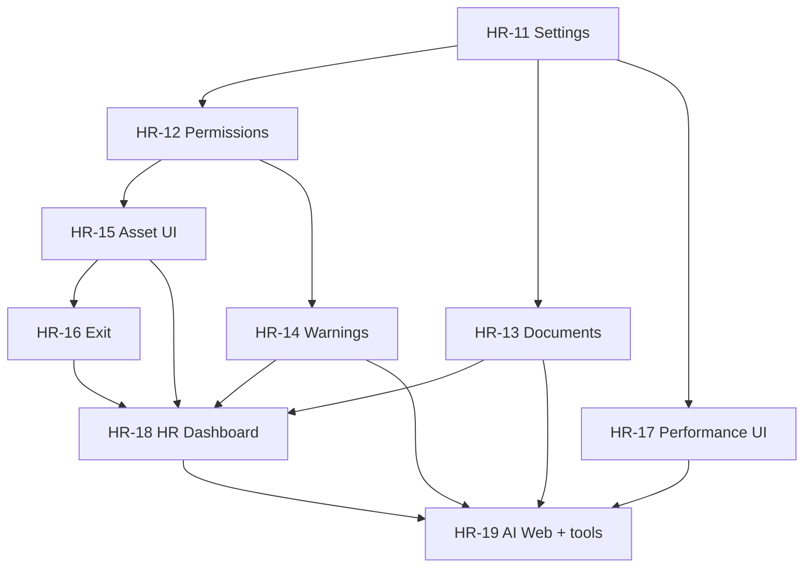

# WorkHQ HR Roadmap (Post–Marketing Split)

**Effective:** 2026-06-22  
**Status:** Planning — configuration-driven HR evolution  
**Related:** [HR_PRODUCT_BOUNDARY.md](./HR_PRODUCT_BOUNDARY.md), `_extracted/marketing-os/`

---

## Core Principle

**WorkHQ HR must be configuration-driven.**

Business rules must **not** be hardcoded in domain services or knowledge articles alone. Every important operational value must be editable from the **Admin Web** (with versioned config and audit where appropriate).

| Category | Examples |
|----------|----------|
| Compensation | Referral reward, deposit amount, meal allowance, manual commission types |
| Leave | Monthly off days, emergency/sick/unpaid rules, reschedule/swap rules |
| Attendance | Grace period, late penalty, break duration, OT policy, missing punch handling |
| Payroll | Cycle dates, pay day, currency display |
| Workflow | Approval chains (leave, payroll, referral, exit) |
| Discipline | Warning policies, escalation thresholds |
| Performance | Scoring weights, grade thresholds, review types |

**Future rule changes = configuration changes, not code deploys.**

**Out of scope for WorkHQ HR:** Marketing daily reports, marketing KPI, marketing commission calculation, marketing insights. MarketingOS is a separate future product. HR receives marketing commission only via **Manual Payroll Items** (`POST /payroll/manual-commissions`).

---

## Current Baseline (Post HR Simplification Sprint)

| Area | State |
|------|--------|
| HR product mode | `MARKETING_ENABLED=false` (backend), `VITE_PRODUCT=hr` (web) |
| Marketing surfaces | Hidden (nav, Telegram, AI tools); APIs retained |
| Manual commission | Implemented — external commission → payroll item → payslip |
| Settings module | **Commission rules only** (`marketing_commission`, `admin_commission`) |
| Web HR pages | Employees, attendance, leave, payroll, knowledge, admin commission settings |
| Backend-only modules | Assets, performance reviews (no web UI yet) |
| Missing domains | Warning management, document upload API, HR settings, permission admin UI |

---

## Roadmap Items

### HR-11 — Settings & Configuration System

**Priority:** CRITICAL  
**Status:** Foundation complete (HR-11A); Attendance migrated (HR-11B); Leave migrated (HR-11C); Referral & Deposit migrated (HR-11D); Telegram Identity (HR-11.5)

#### HR-11A — Settings Engine foundation ✅ COMPLETE

- `SettingProfile`, `SettingVersion`, `SettingAudit` in `system` schema
- `SettingsService` with company → system resolution
- API: `GET/PUT /api/v1/settings/*`, history, audit
- Web: `/settings` hub + category CRUD
- Permissions: `settings:read`, `settings:write`

#### HR-11B — Attendance settings migration ✅ COMPLETE

- Key: `attendance.rules` (JSON blob)
- Hardcoded values removed from `AttendanceRulesService` / `AttendanceService`
- Per-company cache via `AttendanceSettingsService`
- Web: `/settings/attendance` structured form
- Docs: `ATTENDANCE_SETTINGS.md`

#### HR-11C — Leave settings migration ✅ COMPLETE

- Key: `leave.rules` (JSON blob)
- Wired: reschedule, shift swap notice, max reschedules, holiday conversion bonus
- Reserved: emergency/sick entitlement, consecutive penalty, role absence fines, default leave notice
- Web: `/settings/leave` structured form
- Docs: `LEAVE_SETTINGS.md`

#### HR-11D — Referral & deposit settings migration ✅ COMPLETE

- Keys: `referral.rules`, `deposit.rules` (JSON blobs)
- Wired referral: reward amount, employment days, duplicate check gate, auto payroll item
- Reserved referral: `payoutMode` (only `one_time`), `allowMultipleReferrals`
- Wired deposit: enabled, monthly deduction, maximum balance, deduction item type
- Reserved deposit: refund policy fields (exit/refund not wired to settings yet)
- Web: `/settings/referral`, `/settings/deposit`
- Docs: `REFERRAL_SETTINGS.md`, `DEPOSIT_SETTINGS.md`

#### HR-11.5 — Telegram Identity & Access Security ✅ COMPLETE

- Models: `TelegramIdentity`, `RegistrationRequest`, `Employee.inviteCode`
- Verification: employee code + phone (auto-approve), invite code + phone (optional)
- Guard: `TelegramIdentityGuard` + AI self-service protection on Telegram channel
- Web: `/security/registrations`, `/security/telegram-identities`, employee identity tab
- Permissions: `security:read`, `security:write`
- Docs: `TELEGRAM_IDENTITY_SECURITY.md`

**Goal:** Admins/owners modify all company HR rules from the web. No hardcoded business values at runtime.

#### Modules

| Settings area | Config keys (planned) | Current state |
|---------------|----------------------|---------------|
| **Company** | Profile, payroll cycle window, pay day, currency, timezone | Company CRUD exists; no HR settings UI |
| **Attendance** | Grace period, late penalty, break duration, OT policy, missing check-in/out | ✅ `attendance.rules` via Settings Engine |
| **Leave** | Monthly off, emergency/sick/unpaid, reschedule, shift swap | ✅ `leave.rules` (partial — see LEAVE_SETTINGS.md) |
| **Referral** | Reward amount, employment duration, payout timing | ✅ `referral.rules` (partial — see REFERRAL_SETTINGS.md) |
| **Deposit** | Monthly deduction, cap, refund policy | ✅ `deposit.rules` (partial — see DEPOSIT_SETTINGS.md) |
| **Payroll** | Meal allowance per day | `100` THB in `payroll.service.ts` |
| **Workflow** | Approval chains per entity type | `WorkflowDefinition` in schema; prod seed missing |
| **Performance** | Grade thresholds, weights | `DEFAULT_SCORING_CONFIG` in `scoring.service.ts` |

#### Technical approach

Extend the existing **RuleConfig** pattern (`RuleConfigProfile`, `RuleConfigVersion`, `settings` module):

```
RuleConfigDomain (extend enum):
  company | attendance | leave | referral | deposit | payroll | workflow | performance
  (+ existing marketing_commission, admin_commission — hidden in HR mode)
```

- Services read config via `RuleConfigService.getEffectiveConfig(companyId, domain)` with typed defaults (like commission today).
- Admin web: `/settings/hr/*` pages per domain.
- Knowledge base articles remain **advisory**; runtime must read DB config.

#### Acceptance criteria

- [ ] All values in [Hardcoded Values Inventory](#hardcoded-values-inventory) migrated to config with defaults matching current behavior
- [ ] Admin can change referral reward and see effect on new referrals without deploy
- [ ] Leave types + quotas seeded in production seed
- [ ] Workflow definitions seeded for leave, OT, referral, exit
- [ ] Integration tests use config fixtures, not magic numbers in assertions

#### Key files today

- `backend/src/modules/settings/` — extend beyond commission
- `backend/src/modules/settings/domain/rule-config.defaults.ts` — add HR default structs
- `prisma/schema.prisma` — extend `RuleConfigDomain` enum
- `web/src/pages/settings/` — new HR settings pages

---

### HR-12 — Business Role Permission System

**Priority:** CRITICAL  
**Status:** Complete

**Goal:** Role-first access control aligned to the real organization — business roles, scopes, user overrides, and hard-coded salary visibility.

#### Structure

```
User
  └── BusinessRoleAssignment (one active business role)
  └── Role → RolePermission → Permission (bundle engine)
  └── ScopeGrant (all | company | team | self)
  └── UserPermissionOverride (allow | deny, audited)
```

#### Delivered

- Seven business roles seeded: owner, secretary, big_leader, sub_leader, admin_manager, admin, employee
- Resolution: role bundle → scope → override
- `SalaryVisibilityPolicy` (FINAL matrix) applied to payroll/payslip APIs, employee salary history, AI salary tools, Telegram payslip flows
- Admin APIs under `/api/v1/permissions/*`
- Web: `/settings/permissions` (templates, user access, salary preview)
- `BUSINESS_ROLE_PERMISSIONS.md`
- Unit + integration tests

#### Key files

- `backend/src/modules/permission/`
- `backend/prisma/seed.ts`
- `web/src/pages/settings/PermissionsSettingsPage.tsx`
- `BUSINESS_ROLE_PERMISSIONS.md`

---

### HR-13b — Employee Date Events & Tenure ✅ COMPLETE

**Priority:** HIGH  
**Status:** Complete (HR-013b sprint)

**Goal:** Birthday recognition, work anniversary recognition, tenure display, dashboard widgets, daily Telegram scheduler.

#### Delivered

- Policy: EMP-006–EMP-009, HR-013b in `WORKHQ_MASTER_POLICY_V1.md`
- Schema: `dateOfBirth`, `hireDate`, gift tracking fields (EMP-009 reserved)
- Migration: `20260623200000_employee_recognition_fields`
- Backend: `employee-date-events.service`, `employee-events.service`, recognition scheduler + Telegram notifier
- APIs: `GET /employees/dashboard/recognition-events`, `GET /employees/dashboard/tenure-insights`, tenure fields on `GET /employees/:id`
- Web: dashboard widgets (birthdays, anniversaries, longest tenure, probation ending soon), profile date-events + employment sections
- Tests: unit + integration + web helpers
- Access: `employee:read` + `CompanyAccessService.assertCompanyAccess` on dashboard endpoints

#### Remaining gaps

- EMP-009 gift workflow (schema only)
- Full probation-ending-soon dashboard polish (7/14 day tabs)

---

### SEC-001b / EMP-010b — Access hardening & probation automation ✅ COMPLETE

**Status:** Complete (2026-06-23)

**SEC-001b:**
- `POST /employees/rehire` — prior employee company scope
- Payroll cycle items: meal / late / absence / leave-bonus — `assertEmployeeInCompany`
- Disciplinary reads normalized through `EmployeeAccessService`
- Extended `employee-access-audit.integration.spec.ts`

**EMP-010b:**
- Auto-create `ProbationReview` on onboarding (probation status)
- Dashboard: `GET /performance/probation/dashboard` — pending reviews + ending soon
- Telegram inline PASS / EXTEND 30d / FAIL on leader reminders
- EXTEND spawns next pending review; FAIL → exit case (EMP-010c cross-ref)
- Consistency: `scripts/sec-001b-emp-010b-consistency-check.sh`

---

### EMP-011 — Employee Awards & Service Awards ✅ COMPLETE

**Status:** Complete (2026-06-23)

- Extended `EmployeeRecognitionType` enum + migration (`award_month`, `gift_or_reward`, `given_by`)
- Award API via `POST /employees/:id/recognitions` with role-based access
- Service award automation (1/3/5/10 years) in daily recognition scheduler
- Dashboard: `GET /employees/dashboard/awards`
- Employee detail timeline with type filter + Thai labels
- Telegram: employee + leader notification; company broadcast for 5/10-year service awards
- Consistency: `scripts/emp-011-consistency-check.sh` (integration requires `DATABASE_URL`)

---

### EMP-012 — Exit Management & Employee Lifecycle Completion ✅ COMPLETE

**Status:** Complete (2026-06-23)

- Extended `EmployeeExitCase` with `exitType`, `sourceType`, `sourceId` + `ExitChecklistItem` model
- Default 6-item clearance checklist seeded on case creation; syncs legacy boolean flags
- Workflow links: probation FAIL, disciplinary termination, manual `POST /employees/:id/exit`
- Dashboard: `GET /exit-cases/dashboard` — active cases, pending clearance, upcoming dates
- Employee profile: `GET /employees/:id/exit-cases` — active case status + history
- Telegram: new case, daily pending checklist reminder, exit completed
- Access: Owner / Secretary / Big Leader (manage); Employee self-read
- Consistency: `scripts/emp-012-consistency-check.sh` (integration requires `DATABASE_URL`)

---

### EMP-012b — Exit Management Hardening & Completion ✅ COMPLETE

**Status:** Complete (2026-06-23)

- `POST /exit-cases/:id/cancel` — required reason; Owner/Secretary only; Telegram + audit
- Checklist UI: granular items only (legacy bulk-complete removed from web)
- Audit actions: `checklist_item_toggled`, `cancel`, `close`, `settlement_completed`
- Employee Detail: award creation form (EMP-011 API)
- CI docs: integration tests in `.github/workflows/ci.yml` `test-integration` job

---

### PAY-005 — Final Payroll Settlement Engine ✅ COMPLETE

**Status:** Complete (2026-06-23)

- `FinalPayrollSettlement` model + migration (`final_settlement_status` enum)
- Calculation engine: salary prorate, unpaid salary, pending OT/commission/bonus, advance/equipment/penalty deductions, deposit return preview, net payable
- Workflow: draft → pending_review → approved → paid; auto-complete `payroll_settlement_completed` checklist on paid
- APIs: nested exit-case draft/get + `/final-settlements/:id` patch/submit/approve/mark-paid/cancel
- UI: ExitCasePage final settlement section with itemized breakdown and manual adjustments
- Telegram: submitted → Owner; approved → HR/Secretary; paid → employee
- Access: Owner approve; Secretary create/edit/submit/mark paid; Big Leader view; Employee paid-only self read
- Audit: `draft_created`, `edited`, `submitted`, `approved`, `paid`, `cancelled`
- Consistency: `scripts/pay-005-consistency-check.sh` (integration requires `DATABASE_URL`)
- **Note:** Existing deposit settle pipeline (`POST /exit-cases/:id/settle`) unchanged; policy ID **PAY-005b** (advance pay remains **PAY-005**)

---

### PAY-005c — Final Settlement Recalculation & Employee Self-Service ✅ COMPLETE

**Status:** Complete (2026-06-23)

- `POST /final-settlements/:id/recalculate` — draft-only refresh; preserves manual bonus/adjustment/notes; audit `recalculated`
- Deposit visibility on all settlement responses: preview vs settled amounts + status enum
- Employee self-service: `GET /employees/:id/final-settlement/paid-summary`, web `/me/final-settlement`
- Telegram paid notification: amount, date, link button to summary page
- Unpaid salary heuristic documented + unit tests (`open`/`locked` cycles); partial-paid TODO (PR-010)
- Integration: `backend/test/integration/final-settlement-pay005c.integration.spec.ts`
- Consistency: `scripts/pay-005-consistency-check.sh` updated for PAY-005c

---

### PAY-006 — Payroll Bank Transfer Sheet Export ✅ COMPLETE

**Status:** Complete (2026-06-23)

- Models: `PayrollExportBatch`, `PayrollExportItem` with full payout snapshots
- APIs: preview, create export, batch detail/history, XLSX/CSV download, cancel/regenerate
- Validation: locked/paid cycle gate; missing bank / net ≤ 0 / pending adjustments flagged; Owner-confirmed exceptions
- UI: Payroll cycle detail — export preview, exception list, download buttons, export history
- Telegram: Owner + scoped Secretary notified on export creation (not employees)
- Audit: export created/downloaded/regenerated/cancelled
- Consistency: `scripts/pay-006-consistency-check.sh`

---

### PAY-007 — Company Payroll Overview ✅ COMPLETE

**Status:** Complete (2026-06-23)

- API: `GET /payroll/cycles/:id/overview` with company/team/department/position/status filters
- Summary totals: headcount, salary/meal/OT/commission/bonus/deductions/net, exception counts
- Employee rows with masked bank accounts, tenure, payroll status, exception reasons
- Drill-down: `GET /payroll/cycles/:id/overview/employees/:employeeId`
- Permissions via `SalaryVisibilityPolicy.decideCompanyPayrollSummary` + company scope
- UI: `/payroll/cycles/:id/overview` with filters, summary cards, searchable table, detail modal
- Audit: overview viewed, row opened, export initiated from overview
- Consistency: `scripts/pay-007-consistency-check.sh`

---

### SAL-001 — Salary Review & Promotion Workflow ✅ COMPLETE

**Status:** Complete (2026-06-23)

- Models: `SalaryReview`, `PromotionReview` with `CompensationReviewStatus` workflow
- API: salary/promotion CRUD, submit/approve/reject/apply, dashboard, employee timeline
- Apply engine: closes open salary bands, creates `SalaryHistory`, updates employee position on effective date
- Scheduler: daily `applyDueReviews()` for approved reviews past effective date
- Permissions: Owner (all + approve); Secretary (company scope, edit); Big Leader (propose); Employee (own timeline)
- UI: `/hr/compensation-reviews` dashboard; employee detail compensation section
- Telegram: submitted/approved/rejected/applied notifications
- Audit: draft_created, edited, submitted, approved, rejected, applied
- Consistency: `scripts/sal-001-consistency-check.sh`

---

### SAL-001b — Compensation Review UX Completion ✅ COMPLETE

**Status:** Complete (2026-06-23)

- Employee detail forms: create salary/promotion review with auto-filled current values
- Submit flow: draft, submit for approval, create-and-submit
- List page: `/hr/compensation-reviews/list` with filters (type, status, date range, search)
- Dashboard: manual apply button with confirmation for Secretary/Owner
- API: `GET /compensation-reviews/list`; optional `note` on create/update DTOs
- Integration tests: full salary/promotion workflow, unauthorized denial
- Consistency: `scripts/sal-001b-consistency-check.sh`

---

### KPI-001 — Performance KPI Engine Foundation ✅ COMPLETE

**Status:** Complete (2026-06-23)

- Models: `KpiTemplate`, `KpiMetric`, `KpiCycle`, `KpiAssignment`, `KpiScore`, `KpiScoreItem`
- Weighted scoring with grade mapping A (90+) through F (&lt;60)
- APIs: templates, cycles, assign, scores, submit, finalize, dashboard, employee KPI
- UI: `/hr/kpi/templates`, `/hr/kpi/cycles`, cycle detail, employee KPI section
- Dashboard widgets: active cycles, pending reviews, top performers, low scores
- Telegram: assignment created, reviewer score needed, employee finalized
- SAL-001: compensation timeline shows `latestKpiScore` as context on salary review form
- Consistency: `scripts/kpi-001-consistency-check.sh`

---

### KPI-002 — Dynamic KPI Builder ✅ COMPLETE

**Status:** Complete (2026-06-23)

- Position-based KPI templates linked to `PositionDefinition`
- Hybrid metric data sources: MANUAL, FORMULA, SYSTEM, API
- Template lifecycle: clone, archive, delete, version
- `KpiDataSourceService` resolves scores on assignment
- UI: enhanced `/hr/kpi/templates` with position picker and source config
- Consistency: `scripts/kpi-002-consistency-check.sh`

---

### KPI-003 — Performance Review ✅ COMPLETE

**Status:** Complete (2026-06-23)

- Final score = KPI + Leader + Self + 360 (configurable weights via `PerformanceWeightProfile`)
- **No automatic salary recommendation** — Owner decides compensation
- Review cycles, assign employees, 360 feedback, submit/finalize
- Telegram: review created, finalized
- UI: `/hr/performance/reviews`, cycle detail with weighted breakdown
- Consistency: `scripts/kpi-003-consistency-check.sh`

---

### KPI-004 — Position Framework ✅ COMPLETE

**Status:** Complete (2026-06-23)

- Entities: Position Family, Level, Position Definition, Career Path, Promotion Path
- Lifecycle on all: create, edit, delete, archive, clone, version
- Career paths with ordered position steps; promotion paths with requirements
- UI: `/hr/position-framework`
- Consistency: `scripts/kpi-004-consistency-check.sh`

---

### REQ-001 — Universal Request Center ✅ COMPLETE

**Status:** Complete (2026-06-23)

- Models: `RequestInstance`, `RequestValue`, `RequestApprovalStepInstance`, timeline, comments
- Telegram menu `📋 คำร้อง`; Web `/requests`, `/requests/:id`, `/requests/pending`
- Consistency: `scripts/request-platform-consistency-check.sh`

### REQ-002 — Dynamic Request Type Builder ✅ COMPLETE

- `RequestType` / `RequestTypeVersion`; CRUD, publish, archive, clone
- 8 seeded system templates; Web `/admin/request-types`

### REQ-003 — Dynamic Form Builder ✅ COMPLETE

- `RequestFormField` with validation and visibility conditions
- Telegram dynamic step collection; Web preview API

### REQ-004 — Approval Flow Builder ✅ COMPLETE

- `RequestApprovalFlow` / step definitions with conditions
- Telegram + Web approve/reject; approver resolution via hierarchy

### REC-002 — Employee Referral Bonus after Probation ✅ COMPLETE

- `EmployeeReferral`, `ReferralProgram`, `ReferralBonusPayout`
- Probation pass hook; Telegram `👥 แนะนำคน` + `👥 คนที่ฉันแนะนำ`
- Web `/hr/referrals`; payroll item on `markPaid`

---

## Platform Consolidation Sprint (Parts A–G) ✅ COMPLETE

### EMP-014 — Employee Position Linkage ✅

- Employee position FKs; career path API; bulk/migrate tools; missing-assignment dashboard

### KPI-005 — Position-Driven KPI Assignment ✅

- `KpiPositionAssignmentRule` CRUD; template resolution by position; KPI coverage widgets

### SAL-002 — Promotion Path Validation ✅

- Advisory validation; never auto-reject; owner Telegram includes path warning

### REQ-005b — Universal Approval Inbox ✅

- Telegram `📥 งานรออนุมัติ`; unified approve/reject across modules

### REQ-006 — Request Integration Engine ✅

- Approved requests → leave/OT/advance/correction/document queue records

### ATT-010 — Attendance Alert Engine ✅ (prior sprint + verified)

- Scheduler, escalation, Telegram actions, dashboard widget

### DOC-001 — Knowledge & Document Center ✅

- Document center module; Telegram knowledge/doc menus; Web `/documents/my`

### ANN-001 — Announcement & Knowledge Distribution ✅

- Announcement module; acknowledge tracking; Telegram `📢 ประกาศใหม่`; Web `/announcements`

**Consistency:** `scripts/platform-consolidation-consistency-check.sh`

---

### HR-13 — Document Center

**Priority:** HIGH  
**Status:** Partial (schema only)

**Goal:** Store and manage employee documents with upload, download, version history, expiration.

#### Document types (extend enum)

| Type | Purpose |
|------|---------|
| employment_contract | Contract |
| national_id | ID card |
| passport | Passport |
| work_permit | Work permit |
| warning_attachment | Linked to HR-14 |
| exit_document | Linked to HR-16 |
| certificate, resume, other | Existing |

#### Exists

- `EmployeeDocument` model in Prisma

#### Missing

- File storage service (S3/local + `fileKey`)
- Upload/download HTTP API
- Version history + expiration alerts
- Web: employee detail → Documents tab
- AI tool: `get_employee_documents` / missing-document alerts (HR-19)

#### Acceptance criteria

- [ ] `POST /employees/:id/documents` (multipart upload)
- [ ] `GET /employees/:id/documents`, download by id
- [ ] Expiration date field + dashboard widget for expiring docs
- [ ] Permissions: `document:read`, `document:write`

---

### HR-14 — Warning Management

**Priority:** HIGH  
**Status:** Missing

**Goal:** Formal discipline workflow — Warning 1 / 2 / 3 with attachments, notes, employee acknowledgement.

#### Features

- Issue warning (HR/manager with `warning:write`)
- Attach images/documents (links to Document Center)
- Employee acknowledgement via Telegram (+ web optional)
- Warning history visible to managers and HR
- Configurable escalation policy (HR-11)

#### New models (planned)

```
WarningCase
WarningEvent (level 1|2|3, issuedAt, issuedBy, notes)
WarningAcknowledgement (employeeId, acknowledgedAt, channel)
```

#### Acceptance criteria

- [ ] Full CRUD + workflow optional for manager approval
- [ ] Telegram: notify employee, capture acknowledgement
- [ ] Web: employee profile warnings tab; HR warnings list
- [ ] Executive dashboard: active warnings count (HR-18)
- [ ] AI tool: `get_active_warnings`, `get_employee_warning_history` (HR-19)

---

### HR-15 — Asset Management

**Priority:** HIGH  
**Status:** Partial (backend complete, no UI)

**Goal:** Track company equipment with assignment history, return tracking, condition.

#### Asset types

Notebook, mobile phone, SIM, keys, hardware, other company equipment.

#### Exists

- Full backend: `backend/src/modules/asset/` — create, assign, return, damage report, history
- Permissions: `asset:read`, `asset:write`

#### Missing

- Web pages + nav
- Employee profile: assigned assets
- Exit checklist integration (HR-16)

#### Acceptance criteria

- [ ] Web: `/hr/assets`, asset detail, assign/return flows
- [ ] Employee detail shows current assignments
- [ ] Exit workflow blocks until assets returned (HR-16)

---

### HR-16 — Exit Management

**Priority:** HIGH  
**Status:** Partial (`terminate` only)

**Goal:** Resignation/termination workflow with checklist and automatic status closure.

#### Checklist

| Step | System action |
|------|---------------|
| Return assets | HR-15 return all assignments |
| Clear debt | Finance/advance balance check |
| Deposit settlement | Deposit refund per config (HR-11) |
| Final payroll | Open cycle + final items |
| Final payslip | Generate payslip |
| Access revoke | User deactivated, Telegram unlinked |

#### Exists

- `POST /employees/:id/terminate`
- Rehire flow, deposit ledger, finance deposit refund entity

#### Missing

- `ExitCase` model + workflow
- Orchestrated checklist API
- Web: exit initiation + progress tracker

#### Acceptance criteria

- [ ] `POST /employees/:id/exit` starts exit case with checklist
- [ ] Each step validated; cannot complete exit until checklist green
- [ ] Employee status → terminated; user access revoked
- [ ] Audit trail on all steps

---

### HR-17 — Performance Review

**Priority:** HIGH  
**Status:** Partial (backend complete, no UI)

**Goal:** Configurable review cycles — self, peer, manager, 360 — with configurable scoring.

#### Review types

| Type | Description |
|------|-------------|
| Self | Employee self-review |
| Peer | Peer reviews |
| Manager | Manager review |
| 360 | Aggregated multi-rater |

#### Exists

- `backend/src/modules/performance/` — cycles, evaluations, scoring, probation reviews
- Workflow integration (`performance_review` entity type)
- Permissions: `performance:read`, `performance:score`, `performance:configure`, `performance:finalize`

#### Missing

- Scoring config in HR-11 (not hardcoded thresholds)
- Web UI for cycles, evaluations, results
- Telegram notifications for review requests

#### Acceptance criteria

- [ ] Admin configures scoring weights/thresholds via settings
- [ ] Web: performance cycle management, employee evaluation views
- [ ] 360 aggregation respects configurable weights

---

### HR-18 — HR Executive Dashboard

**Priority:** HIGH  
**Status:** Partial (generic reporting exists; not HR-focused)

**Goal:** Owner dashboard for HR operations — **not** marketing/commission executive views.

#### Widgets (HR mode)

| Widget | Source |
|--------|--------|
| Headcount / active employees | Employee module |
| Attendance today | Attendance |
| Late today | Attendance rules + records |
| Leave today | Leave requests |
| OT today | Overtime records |
| Active warnings | HR-14 |
| Debt outstanding | Finance/advance |
| Referral pending | Referral |
| Payroll summary | Payroll cycles |
| Missing documents | HR-13 |
| Unreturned assets | HR-15 |

#### Exists

- `GET /reporting/companies/:id/dashboard`
- Executive insight service (mixed marketing metrics — filter in HR mode)
- `ExecutivePage.tsx` hidden when `VITE_PRODUCT=hr`

#### Missing

- Dedicated **HR Executive Dashboard** API + page enabled in HR product mode
- Company filter support across all widgets

#### Acceptance criteria

- [ ] `GET /reporting/hr/dashboard?companyId=` — HR-only metrics
- [ ] Web: `/dashboard` or `/hr/executive` visible in HR mode
- [ ] No marketing KPI / commission widgets in HR mode

---

### HR-19 — AI HR Copilot

**Priority:** HIGH  
**Status:** Partial (Telegram + API; no web UI)

**Goal:** Read-only HR assistant over real data — no marketing tools in HR mode.

#### Example questions

- Who is late most often?
- Who has outstanding debt?
- Who should be promoted?
- Which employees have active warnings?
- Which employees have missing documents?
- Which employees have not returned assets?

#### Exists

- `POST /api/v1/ai/chat` with tiered tools (employee/leader/owner)
- Telegram: 🤖 ผู้ช่วย AI
- HR tools: leave, attendance, payslip, referral, team summaries, knowledge search
- Marketing tools filtered when `MARKETING_ENABLED=false`

#### Missing (post HR-11–18)

- Tools for warnings, documents, assets, exit, performance (as modules ship)
- Web chat UI + nav entry
- HR-branded system prompt

#### Acceptance criteria

- [ ] Web: `/hr/ai` chat page
- [ ] New tools added as HR-13–17 ship
- [ ] All responses read-only; no write actions via AI
- [ ] Permission-gated tool exposure unchanged

---

## Hardcoded Values Inventory

Values to migrate under **HR-11** (defaults preserve current behavior):

| Domain | Value | File |
|--------|-------|------|
| Referral reward | ฿2,000 | ✅ `referral.rules` (Settings Engine) |
| Meal allowance | ฿100/day | `payroll/application/payroll.service.ts` |
| Deposit | ฿500/month, cap ฿3,000 | ✅ `deposit.rules` (Settings Engine) |
| Late grace | 15 minutes | ✅ `attendance.rules` (Settings Engine) |
| Shift / break | 09:00–21:00, 60-min break | ✅ `attendance.rules` |
| OT rate | ฿50/hr | ✅ `attendance.rules` |
| Holiday conversion | ฿600/day, cap ฿1,200 | `leave/domain/services/holiday-conversion.service.ts` |
| Leave reschedule | 7-day notice, max 1 reschedule | `leave/domain/services/leave-reschedule-policy.service.ts` |
| Referral qualification | ~3 months employed | ✅ `referral.rules` (`requiredEmploymentDays`, default 90) |
| Performance grades | A≥90, B≥75, C≥60, D≥50 | `performance/domain/services/scoring.service.ts` |
| Admin commission leave allowance | 4 days | `settings/domain/rule-config.defaults.ts` |

---

## Recommended Implementation Order



| Phase | Items | Rationale |
|-------|-------|-----------|
| **1 — Foundation** | HR-11, HR-12 | Config + permissions unblock all admin surfaces |
| **2 — Employee records** | HR-13, HR-15 UI | Documents + assets on employee profile |
| **3 — Lifecycle** | HR-14, HR-16, HR-17 UI | Discipline, exit, performance |
| **4 — Visibility** | HR-18 | HR executive dashboard |
| **5 — Copilot** | HR-19 web + new tools | Layer on completed modules |

---

## Keep in WorkHQ HR

Employee · Company · Department · Team · Attendance · Leave · Payroll · Referral · Debt · Deposit · Documents · Warnings · Assets · Exit · Performance · AI HR · Manual Commission Entry · Admin Commission (HR incentive) · Workflow · Knowledge Base

## Not in WorkHQ HR

Marketing daily reports · Marketing KPI · Marketing expenses · Marketing teams · Marketing commission **calculation** · Marketing insights · AI Marketing Manager · Marketing executive dashboard

→ Archived in `_extracted/marketing-os/` for separate MarketingOS rebuild.

---

## Success Metrics

1. **Zero new hardcoded business constants** in domain services after HR-11 ships
2. **Admin can change referral reward** without developer involvement
3. **All HR modules have web surfaces** for admin and (where applicable) employee self-service
4. **HR executive dashboard** is the default owner landing view in HR mode
5. **Integration test suite** remains green with config-driven defaults

---

## Document History

| Date | Change |
|------|--------|
| 2026-06-22 | Initial roadmap post–Marketing Split and HR Simplification Sprint |
| 2026-06-24 | Employee Experience Platform Sprint: team calendar, PDF generation, document center enhancements, announcement audit |
| 2026-06-24 | Production Hardening Sprint: Bangkok timezone schedulers, announcement reminders, document versioning/storage, calendar UI, TEST-001b matrix |
| 2026-06-24 | Final Hardening Sprint: INF-001c domain DateProvider migration, TEST-001c factories/matrix, employee home summary, owner announcement escalation, production-readiness-check.sh |
| 2026-06-24 | Next Phase Sprint: AI-001 Knowledge Assistant, TRAIN-001 Training Library, ANALYTICS-001 HR Analytics, AUDIT-002 Audit Explorer, OPS-001 Ops Console; `scripts/next-phase-ai-training-analytics-check.sh` |
| 2026-06-24 | Phase 2 HR OS Sprint: WF-001, RULE-001, WF-002, AI-002, HR-020, HR-021, AI-003; `scripts/workhq-phase2-hr-os-check.sh` |
| 2026-06-24 | Production Stabilization: Telegram menus, 08:00 AI brief, formula Phase 1, integration tests, UAT checklist; `scripts/workhq-production-stabilization-check.sh` |
| 2026-06-24 | **EMP-001b/c:** Telegram invite link onboarding + self-onboarding form + HR review; see `WORKHQ_EMP001_COMPLETION_REPORT.md` |

---

## EMP-001b / EMP-001c — Telegram Invite + Self-Onboarding ✅ IMPLEMENTED

**Goal:** Replace employee-code Telegram onboarding with secure invite links; employee fills personal info + documents via bot; HR approves before profile update.

| Component | Status |
|-----------|--------|
| `EmployeeTelegramInvite` model + APIs | ✅ |
| `/start invite_<token>` deep link | ✅ |
| Telegram multi-step self-onboarding form | ✅ |
| `EmployeeSelfOnboardingSubmission` + HR review APIs | ✅ |
| Web `/hr/self-onboarding` + employee detail invite button | ✅ |
| Dashboard widgets (6 stats) | ✅ |
| HR Telegram notification on submit | ✅ |
| Employee Telegram notification on approve/reject | ✅ |
| Side-by-side diff review UI | ⏳ Partial (list only) |
| Big Leader team connected visibility | ⏳ Not implemented |

---

## Phase 2 HR OS Sprint (2026-06-24)

| ID | Status | Deliverables |
|----|--------|--------------|
| **WF-001** | **Complete** | Workflow Builder on Request Platform; `/admin/workflows`; action steps; immutable published versions |
| **RULE-001** | **Complete** | Safe Formula Engine; `/admin/formulas`; IF/MIN/MAX/ROUND; execution logs |
| **WF-002** | **Complete** | Dynamic Approval Flow Builder; `/approval-flows`; condition routing; Telegram inbox |
| **AI-002** | **Complete** | AI Manager insights + morning brief; `/ai/manager`; advisory-only |
| **HR-020** | **Complete** | Competency Matrix; `/hr/competencies`; gap analysis |
| **HR-021** | **Complete** | Succession Planning; `/hr/succession`; critical roles + readiness |
| **AI-003** | **Complete** | HR Knowledge Graph; `/ai/knowledge-graph`; permission-aware queries |

**Out of scope:** Finance/P&L, accounting, revenue, CRM, marketing platform.

---

## Next Phase Sprint — AI, Training & Advanced Analytics (2026-06-24)

| ID | Status | Deliverables |
|----|--------|--------------|
| **AI-001** | **Complete (MVP)** | `AiKnowledgeSource`/`AiKnowledgeChunk`/`AiQueryLog`; `POST /ai/knowledge-assistant`; Telegram 🤖 ถาม WorkHQ; Web `/ai/knowledge-assistant` |
| **TRAIN-001** | **Complete (MVP)** | `TrainingCourse`/`TrainingLesson`/`TrainingAssignment`/`TrainingQuiz*`; `/training` API + web; Telegram 📚 การเรียนรู้ |
| **ANALYTICS-001** | **Complete (MVP)** | `HrDailySnapshot`/`PayrollMonthlySnapshot`; `GET /analytics/hr/dashboard`; Telegram 📊 สรุป HR วันนี้ |
| **AUDIT-002** | **Complete (MVP)** | `GET /audit/logs`, export CSV, salary redaction; Web `/audit` |
| **OPS-001** | **Complete (MVP)** | Owner-only `/ops/health` + retry/rerun actions with audit; Web `/ops` |

### Remaining gaps (follow-up)

- Full knowledge source sync from handbook/SOP markdown on deploy
- Training assign-by team/position/role bulk resolver
- Analytics: KPI distribution, commission totals, full owner widget set
- Ops: wire real outbox dispatch + scheduler manual triggers
- Dedicated `audit:read` permission (currently uses `settings:read`)
