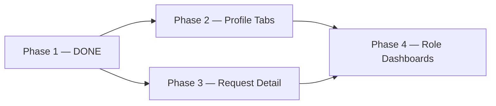

# UX-001 — Prototype Implementation Plan

**WorkHQ Practical UX Reset** · Rollout phases  
อัปเดต 2026-06-25

---

## 1. Overview

| Phase | Scope | Status | Target |
|-------|-------|--------|--------|
| **Phase 1** | Nav + hubs + dashboard tasks | ✅ **DONE** | 2026-06-24 |
| **Phase 2** | Employee profile tabs | 🔲 Planned | TBD |
| **Phase 3** | Request detail enhancement | 🔲 Planned | TBD |
| **Phase 4** | Role-specific dashboards | 🔲 Planned | TBD |

---

## 2. Phase 1 — Nav + Hubs + Dashboard Tasks ✅ DONE

### 2.1 Goals

- ลด sidebar เป็น **12 task-first items**
- สร้าง **hub pages** สำหรับ module หลัก
- รวม **Settings** (Workflow, Formula, Request Type, Telegram, Permission Matrix)
- เพิ่ม **`/my-work`** และ **PracticalDashboardTasks**
- สร้าง **WorkHQ navigation/state components**

### 2.2 Deliverables (completed)

| Deliverable | Status |
|-------------|--------|
| `nav-config.ts` — 12-item sidebar | ✅ |
| `WorkHQAppLayout` — filtered nav | ✅ |
| `MyWorkPage` | ✅ |
| `PracticalDashboardTasks` on Dashboard | ✅ |
| Hub: Requests | ✅ |
| Hub: Attendance | ✅ |
| Hub: Leave | ✅ |
| Hub: Performance | ✅ |
| Hub: Reports | ✅ |
| Hub: Commission | ✅ |
| Hub: Settings | ✅ |
| `WorkHQTabNav` | ✅ |
| `WorkHQBreadcrumb` | ✅ |
| `WorkHQPageHeader` (used across hubs) | ✅ |
| `WorkHQPracticalErrorState` | ✅ |
| `WorkHQPermissionDenied` | ✅ |
| `WorkHQEmptyState` (existing, adopted) | ✅ |
| `CreateRequestPage` — breadcrumb + practical layout | ✅ |
| `InvitationCodePage` — UX-001 layout | ✅ |
| `EmployeesPage` — PageHeader (partial) | ✅ |
| Routes in `App.tsx` for hubs | ✅ |
| UX-001 documentation (7 files) | ✅ |

### 2.3 Files Implemented (Phase 1)

#### Navigation & Layout

| File | Change |
|------|--------|
| `web/src/layout/nav-config.ts` | **New** — UX-001 12-item NAV_GROUPS |
| `web/src/components/ui/WorkHQAppLayout.tsx` | Updated — consume nav-config |
| `web/src/App.tsx` | Routes for hubs, my-work |

#### Hub Pages (New)

| File | Route |
|------|-------|
| `web/src/pages/my-work/MyWorkPage.tsx` | `/my-work` |
| `web/src/pages/requests/RequestsHubPage.tsx` | `/requests`, `/requests/mine`, `/requests/templates` |
| `web/src/pages/attendance/AttendanceHubPage.tsx` | `/attendance` |
| `web/src/pages/leave/LeaveHubPage.tsx` | `/leave` |
| `web/src/pages/performance/PerformanceHubPage.tsx` | `/performance` |
| `web/src/pages/reports/ReportsHubPage.tsx` | `/reports` |
| `web/src/pages/commission/CommissionHubPage.tsx` | `/commission` |
| `web/src/pages/settings/SettingsHubPage.tsx` | `/settings` |

#### Dashboard

| File | Change |
|------|--------|
| `web/src/pages/DashboardPage.tsx` | PracticalDashboardTasks integration, todayTasks logic |
| `web/src/components/dashboard/PracticalDashboardTasks.tsx` | **New** — task list + quick actions |

#### UI Components (New / Enhanced)

| File | Purpose |
|------|---------|
| `web/src/components/ui/WorkHQTabNav.tsx` | Route tabs |
| `web/src/components/ui/WorkHQBreadcrumb.tsx` | Breadcrumb nav |
| `web/src/components/ui/WorkHQPracticalErrorState.tsx` | API error panel |
| `web/src/components/ui/WorkHQPermissionDenied.tsx` | 403 empty state |
| `web/src/components/ui/WorkHQPageHeader.tsx` | Page title + actions |
| `web/src/components/ui/WorkHQEmptyState.tsx` | Empty state (pre-existing) |
| `web/src/components/ui/WorkHQStatCard.tsx` | Stat cards (pre-existing) |
| `web/src/components/ui/index.ts` | Export barrel updated |

#### Enhanced Pages

| File | Change |
|------|--------|
| `web/src/pages/requests/CreateRequestPage.tsx` | Breadcrumb, WorkHQPage shell |
| `web/src/pages/hr/InvitationCodePage.tsx` | Full UX-001 layout |
| `web/src/pages/hr/EmployeesPage.tsx` | WorkHQPageHeader |

#### Documentation

| File | Purpose |
|------|---------|
| `USER_JOURNEY.md` | Personas + journeys |
| `WORKHQ_IA_REDESIGN.md` | Before/after IA |
| `SCREEN_INVENTORY_200.md` | 200 screens |
| `PRACTICAL_SCREEN_SPEC.md` | Key screen specs |
| `COMPONENT_SPEC.md` | Component catalog |
| `EMPTY_LOADING_ERROR_STATE_SPEC.md` | State patterns |
| `PROTOTYPE_IMPLEMENTATION_PLAN.md` | This file |

### 2.4 Phase 1 Verification

```bash
# Web dev smoke
cd web && npm run build

# Key routes to manual test
/dashboard
/my-work
/requests
/attendance
/leave
/performance
/reports
/settings
/hr/invitation
```

| Test | Expected |
|------|----------|
| Sidebar shows ≤12 items (HR mode) | ✅ |
| Workflow not in sidebar | ✅ — only in Settings advanced |
| Dashboard shows task card when pending work | ✅ |
| My Work aggregates approvals + onboarding | ✅ |
| Breadcrumb on hub pages | ✅ |

---

## 3. Phase 2 — Employee Profile Tabs 🔲 Planned

### 3.1 Goals

- แปลง `EmployeeDetailPage` จาก stacked sections → **tabbed profile**
- ใช้ `WorkHQTabNav` + URL hash or `/hr/employees/:id/:tab`
- Consistent breadcrumb: `ภาพรวม › พนักงาน › {name} › {tab}`

### 3.2 Planned tabs

| Tab | Section component |
|-----|-------------------|
| overview | Profile header, probation, tenure |
| personal | Contact, bank (visibility gated) |
| documents | `EmployeeDocumentsSection` |
| telegram | `EmployeeTelegramInviteSection` |
| leave | `EmployeeLeaveCalendarSection` |
| kpi | `EmployeeKpiSection` |
| performance | `EmployeePerformanceReviewSection` |
| compensation | `EmployeeCompensationSection` |

### 3.3 Files to touch

| File | Work |
|------|------|
| `web/src/pages/hr/EmployeeDetailPage.tsx` | Tab routing |
| `web/src/App.tsx` | Optional `:tab` route |
| `web/src/components/hr/EmployeeProfileSections.tsx` | Tab panel wrapper |
| `EmployeesPage.tsx` | Migrate ErrorState → WorkHQ |
| `ApprovalsPage.tsx` | Migrate ErrorState → WorkHQ |

### 3.4 Acceptance criteria

- [ ] Deep link `/hr/employees/:id/documents` opens documents tab
- [ ] Salary tab hidden without salary visibility permission
- [ ] Mobile: tabs scroll horizontally

---

## 4. Phase 3 — Request Detail Enhancement 🔲 Planned

### 4.1 Goals

- ปรับ `RequestDetailPage` ให้เป็น **action-first** layout
- Timeline ชัดเจน (submit → approve chain → complete)
- Inline approve/reject สำหรับ `workflow:act`
- แสดงช่องทางยื่น (web / telegram)
- Attachments + form field summary

### 4.2 Files to touch

| File | Work |
|------|------|
| `web/src/pages/requests/RequestDetailPage.tsx` | Layout redesign |
| `web/src/components/approvals/ApprovalTimeline.tsx` | Reuse / extend |
| New: `WorkHQRequestSummary.tsx` | Field summary card |

### 4.3 Acceptance criteria

- [ ] Approve from detail without navigating to `/approvals`
- [ ] Telegram-originated requests show channel badge
- [ ] Empty timeline state documented
- [ ] Breadcrumb: `ภาพรวม › คำขอ › {type} #{id}`

---

## 5. Phase 4 — Role-Specific Dashboards 🔲 Planned

### 5.1 Goals

- แยก dashboard experience ตาม persona
- ลด widget noise สำหรับ Employee
- Owner/Secretary ได้ actionable tasks มากขึ้น

### 5.2 Planned variants

| Role | Dashboard focus |
|------|-----------------|
| Owner | Approvals, payroll risk, exit, executive link |
| Secretary | Onboarding, invitation, docs, payroll prep |
| Leader | Team attendance, approvals, calendar |
| Employee | Home summary only — 4 stat cards + quick links |

### 5.3 Implementation approach

```tsx
// Pseudocode — DashboardPage.tsx
const variant = resolveDashboardVariant(user.businessRole);
return variant === 'employee' ? <EmployeeDashboard /> : <HrDashboard variant={variant} />;
```

### 5.4 Files to touch

| File | Work |
|------|------|
| `web/src/pages/DashboardPage.tsx` | Split or conditional render |
| New: `web/src/components/dashboard/OwnerDashboard.tsx` | |
| New: `web/src/components/dashboard/EmployeeDashboard.tsx` | |
| `PracticalDashboardTasks.tsx` | Role-specific task sources |

### 5.5 Acceptance criteria

- [ ] Employee login ไม่เห็น exit/awards tables
- [ ] Owner sees Morning Brief link (web → Telegram deep link)
- [ ] Secretary default quick action = Invitation

---

## 6. Dependency Graph



Phase 2 และ 3 ทำ parallel ได้; Phase 4 ควรหลัง 2+3

---

## 7. Out of Scope (UX-001)

| Item | Reason |
|------|--------|
| Backend API changes | UI-only reset |
| Telegram bot menu restructure | Already audited PASS |
| Marketing product split | Separate PRODUCT_SPLIT |
| Full i18n extraction | Incremental |

---

## 8. Risk Register

| Risk | Mitigation |
|------|------------|
| Bookmarked old admin URLs | Routes preserved |
| Permission regression | QA per role matrix |
| Hub pages feel like extra click | TabNav + cards = 1-click to sub-route |
| Employee profile tab URL breaking | Keep default tab = overview |

---

## 9. Sign-off

| Phase | Owner | Date |
|-------|-------|------|
| Phase 1 | UX-001 | 2026-06-24 |
| Phase 2 | TBD | — |
| Phase 3 | TBD | — |
| Phase 4 | TBD | — |

---

## 10. Quick Links

- IA: `WORKHQ_IA_REDESIGN.md`
- Screens: `SCREEN_INVENTORY_200.md`
- Components: `COMPONENT_SPEC.md`
- Telegram parity: `WORKHQ_TELEGRAM_AUDIT.md`
