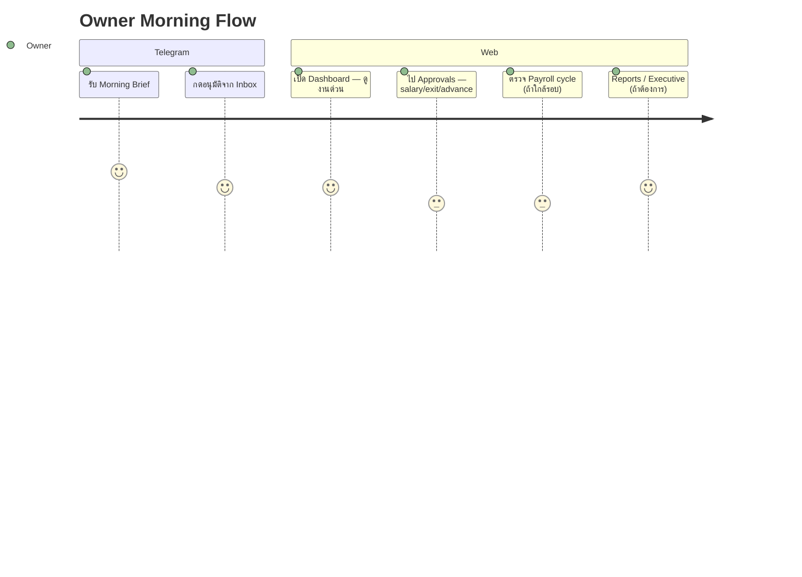
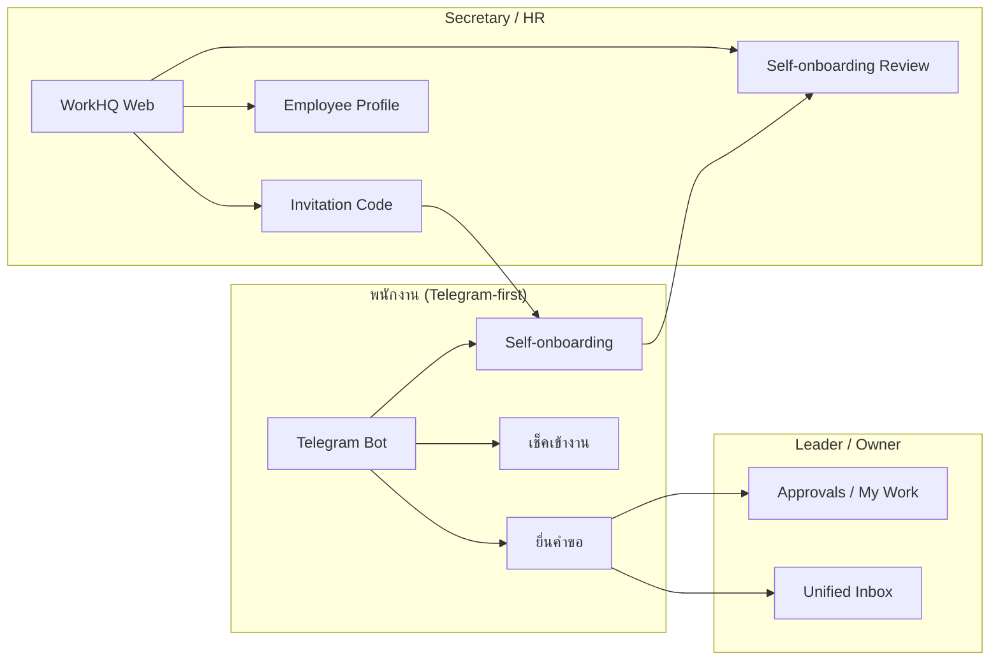

# UX-001 — User Journey & Personas

**WorkHQ Practical UX Reset** · อัปเดต 2026-06-25  
**หลักการ:** Telegram-first สำหรับพนักงาน · Web task-first สำหรับ HR/Leader/Owner

---

## 1. Personas (บทบาทธุรกิจ)

WorkHQ ใช้ **Business Role** เป็นหลัก (ไม่ใช่แค่ permission ทางเทคนิค) โดยแต่ละ role เห็น sidebar, Dashboard tasks และ Telegram menu ต่างกัน

| Persona | ภาษาไทย | ใครบ้าง | Web หลัก | Telegram หลัก |
|---------|---------|---------|----------|---------------|
| **Owner** | เจ้าของ / ผู้บริหารสูงสุด | ผู้ถือ equity, อนุมัติขั้นสุดท้าย | Dashboard (owner hint), Approvals, Payroll, Reports, Settings | Morning Brief, Unified Inbox, AI Manager |
| **Secretary** | เลขา / HR Ops | ดูแลพนักงาน, onboarding, payroll prep | Dashboard (secretary hint), Employees, Invitation, My Work | เมนู Owner (overlap โดย design) |
| **Big Leader** | หัวหน้าใหญ่ / หัวหน้าฝ่าย | ดูแลหลายทีม, marketing overview (ถ้าเปิด) | Approvals, Performance, Reports | Team KPI, Company marketing (marketing mode) |
| **Leader** | หัวหน้างาน / Sub-leader | อนุมัติทีม, ปฏิทิน, attendance alerts | Approvals, Attendance, Leave hub | Unified Inbox, Team Calendar, Attendance alerts |
| **Employee** | พนักงาน | ยื่นคำขอ, ดูสลิป, เอกสาร | Dashboard (employee home summary), My Work, Requests | 13 เมนูหลัก — ไม่ต้องเปิด web บ่อย |

### Permission ที่เกี่ยวข้อง (ย่อ)

| Persona | Permissions โดยทั่วไป |
|---------|----------------------|
| Owner | `reporting:owner`, `settings:read`, `workflow:act`, `payroll:write`, … |
| Secretary | `employee:write`, `payroll:read`, `workflow:read`, … |
| Big Leader / Leader | `workflow:act`, `attendance:read`, `leave:read`, `performance:read` (scope ทีม) |
| Employee | `workflow:read` (ของตัวเอง), `document:read`, `leave:read` (ของตัวเอง) |

---

## 2. Pain Points ที่ UX-001 แก้

| Pain (ก่อน) | ผลกระทบ | วิธีแก้ (UX-001) |
|-------------|---------|-----------------|
| Sidebar 30+ รายการ แยกตาม module | หลงทาง, Owner ไม่รู้เริ่มจากไหน | **12-item task-first sidebar** + hub pages |
| Workflow / Formula / Request Type อยู่เมนูหลัก | HR สับสนกับ "งานวันนี้" vs "ตั้งค่าระบบ" | ย้ายไป **Settings hub** (ขั้นสูง) |
| ไม่มีหน้า "งานของฉัน" รวมศูนย์ | ต้องเปิดหลาย module เพื่อดูคิว | **`/my-work`** รวม approval, onboarding, docs, telegram |
| Dashboard เป็นแค่ stat cards | ไม่บอกว่าต้องทำอะไรก่อน | **`PracticalDashboardTasks`** — ด่วน / อื่นๆ + quick actions |
| Employee ต้องใช้ web ยื่นทุกอย่าง | adoption ต่ำ | **Telegram button-based forms** + invite link onboarding |
| Error / empty ไม่สม่ำเสมอ | ผู้ใช้ติด, ไม่รู้ next step | **`WorkHQPracticalErrorState`**, **`WorkHQEmptyState`**, **`WorkHQPermissionDenied`** |
| Breadcrumb / tab ไม่มีมาตรฐาน | สับสน hierarchy | **`WorkHQBreadcrumb`**, **`WorkHQTabNav`** |

---

## 3. Journey Maps

### 3.1 Owner — "เช้าวันจันทร์ 08:00"

| Step | Channel | Action | Screen / Route |
|------|---------|--------|----------------|
| 1 | Telegram | อ่าน Morning Brief + counts | Bot → `ai:brief:today` |
| 2 | Telegram/Web | อนุมัติคำขอด่วน | `/approvals` หรือ inline ใน bot |
| 3 | Web | ดู "วันนี้ต้องทำอะไร" | `/dashboard` → PracticalDashboardTasks |
| 4 | Web | ตรวจ onboarding รออนุมัติ | `/hr/self-onboarding` |
| 5 | Web | ตั้งค่า workflow (นานๆ ครั้ง) | `/settings` → Workflow |

**Success metric:** Owner ทำงานด่วนที่สุดได้ภายใน 3 คลิกจาก Dashboard

---

### 3.2 Secretary — "รับพนักงานใหม่"

| Step | Action | Screen |
|------|--------|--------|
| 1 | สร้าง employee record ขั้นต่ำ | `/hr/employees/new` |
| 2 | สร้าง Telegram invite link (7 วัน) | `/hr/invitation` |
| 3 | ส่งลิงก์ให้พนักงาน (Line/Telegram) | — |
| 4 | พนักงานกรอก self-onboarding ใน bot | Telegram EMP-001c |
| 5 | Secretary ตรวจ + อนุมัติข้อมูล | `/hr/self-onboarding` |
| 6 | ข้อมูล bank/docs promote เข้าระบบ | อัตโนมัติหลัง approve |

**Pain solved:** ไม่ต้องกรอกทุก field ใน web; HR-only fields ถูก reject ที่ server

---

### 3.3 Big Leader — "ดูภาพรวมทีม + marketing"

| Step | Action | Screen |
|------|--------|--------|
| 1 | เปิด My Work — ดูคิวรออนุมัติ | `/my-work` |
| 2 | อนุมัติคำขอทีม | `/approvals` |
| 3 | ดู KPI ทีม / รอบประเมิน | `/performance` → `/hr/kpi/cycles` |
| 4 | (Marketing mode) ดู commission / reports | `/commission`, `/reports` |

---

### 3.4 Leader — "จัดการทีมประจำวัน"

| Step | Channel | Action |
|------|---------|--------|
| 1 | Telegram | Attendance alerts — ใครยังไม่ check-in |
| 2 | Web | `/attendance/daily` — ตรวจรายชื่อ |
| 3 | Web/Telegram | อนุมัติ OT / leave จาก inbox |
| 4 | Web | `/calendar/team` — วางแผนกะ |

**Telegram parity:** Leader menu 6 รายการ + unified inbox (เทียบ web Approvals)

---

### 3.5 Employee — Telegram-first

พนักงานส่วนใหญ่ **ไม่เปิด web** ยกเว้นดู payslip ซับซ้อนหรือ HR ส่งลิงก์

| งาน | Primary | Secondary (Web) |
|-----|---------|-----------------|
| ยื่นลา | Telegram `leave:menu` (button dates) | `/requests/create` |
| ดูเวลาเข้างาน | Telegram `attendance:menu` | `/attendance` (read-only ถ้ามีสิทธิ์) |
| ยื่นคำร้อง (OT, advance, …) | Telegram `request:menu` | `/requests/mine` |
| ดูสลิป | Telegram `payroll:view_payslip` | `/payroll/cycles` (self) |
| เอกสาร / ประกาศ | Telegram document + announcement | `/documents/my` |
| ถาม HR | Telegram `ai:knowledge` | `/ai/knowledge-assistant` |

**Employee web journey (เมื่อจำเป็น):**

1. Login → Dashboard แสดง **สรุปของฉัน** (leave, pending requests, docs, announcements)
2. `/my-work` — คำขอของฉันรอดำเนินการ
3. `/requests/mine` — ติดตามสถานะ

---

## 4. Cross-Channel Flow Diagram

---

## 5. Entry Points ตาม Persona

| Persona | First screen หลัง login | Quick actions ที่แนะนำ |
|---------|-------------------------|------------------------|
| Owner | `/dashboard` (owner hint) | Approvals, Payroll, Reports |
| Secretary | `/dashboard` (secretary hint) | Invitation, Employees, Self-onboarding |
| Big Leader | `/my-work` | Approvals, Performance |
| Leader | `/my-work` หรือ `/approvals` | Attendance daily, Team calendar |
| Employee | `/dashboard` (employee home) | Requests mine, Documents |

---

## 6. Design Principles สำหรับ Journey ต่อไป

1. **Task before module** — ถาม "วันนี้ต้องทำอะไร?" ก่อน "อยู่ module ไหน?"
2. **Telegram = action, Web = review & bulk** — ยื่น/อนุมัติเร็วใน bot; ตรวจรายละเอียดใน web
3. **Settings ≠ daily work** — config อยู่ `/settings` เท่านั้น
4. **Same vocabulary** — ชื่อเมนู sidebar ตรงกับ hub title และ breadcrumb
5. **Permission-aware empty states** — ไม่แสดงลิงก์ที่กดแล้วได้ 403

---

## 7. Related Docs

- `WORKHQ_IA_REDESIGN.md` — โครงสร้างเมนูใหม่
- `PRACTICAL_SCREEN_SPEC.md` — spec หน้าหลัก
- `PROTOTYPE_IMPLEMENTATION_PLAN.md` — Phase 1–4 rollout
- `WORKHQ_TELEGRAM_AUDIT.md` — Telegram menu matrix
