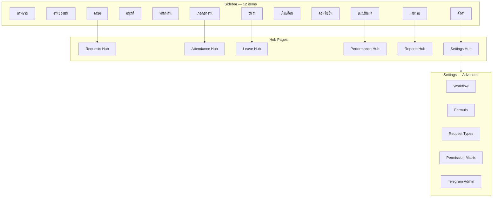

# UX-001 — WorkHQ Information Architecture Redesign

**WorkHQ Practical UX Reset** · อัปเดต 2026-06-25  
**เป้าหมาย:** ลด cognitive load · จัดงานรายวันให้เจอใน ≤3 คลิก · แยก "ตั้งค่าระบบ" ออกจาก "ทำงาน"

---

## 1. Executive Summary

| มิติ | Before (Module-first) | After (Task-first) |
|------|----------------------|-------------------|
| Sidebar items | 25–40+ รายการ แบ่ง 8–12 groups | **12 รายการ** ใน group เดียว "เมนูหลัก" |
| Navigation mental model | "ฉันอยู่ module ไหน?" | "ฉันต้องทำอะไรวันนี้?" |
| Config / Admin | ปนใน HR, Workflow, Security groups | **Settings hub** + Advanced section |
| Deep links | กระจายใน sidebar | **Hub pages** + TabNav ภายใน module |
| Employee UX | บังคับ web | **Telegram-first**; web เป็น secondary |

---

## 2. Before IA (Module-first Sidebar)

อ้างอิง mockup เดิม (`docs/design-system/mockups/index.html`) และ nav ก่อน UX-001:

```
หน้าหลัก
  └── ภาพรวม

ทรัพยากรบุคคล
  ├── พนักงาน
  ├── โครงสร้างองค์กร
  ├── รออนุมัติสมัคร
  └── บัญชี Telegram

การเข้างาน
  ├── บันทึกประจำวัน
  └── อนุมัติ OT

การลา
  ├── คำขอลา
  ├── เลื่อนวันลา
  └── สลับกะ

เงินเดือน
  ├── รอบเงินเดือน
  └── ...

Workflow / Admin (กระจาย)
  ├── Request Types
  ├── Workflows
  ├── Formulas
  └── Approval Matrix

Security
  ├── Pending Registrations
  └── Telegram Identities

Performance / KPI (แยกหลายที่)
Reports / Ops / AI (แยก groups)
Marketing (ถ้าเปิด — group แยก)
```

**ปัญหา:** Owner เปิด sidebar แล้วไม่รู้ว่า "อนุมัติคำขอ" อยู่ Workflow, Leave หรือ Requests

---

## 3. After IA (Task-first — 12 Sidebar Items)

Implementation: `web/src/layout/nav-config.ts`

| # | Label (TH) | Route | matchPrefix | Permission | บทบาทหลัก |
|---|------------|-------|-------------|------------|-----------|
| 1 | ภาพรวม | `/dashboard` | — | (all) | ทุก role |
| 2 | งานของฉัน | `/my-work` | — | `workflow:read` | Leader+, Secretary |
| 3 | คำขอ | `/requests` | `/requests` | `workflow:read` | ทุก role ที่ยื่นคำขอ |
| 4 | อนุมัติ | `/approvals` | `/approvals` | `workflow:act` | Leader, Owner |
| 5 | พนักงาน | `/hr/employees` | `/hr/employees` | `employee:read` | HR, Owner |
| 6 | เวลาเข้างาน | `/attendance` | `/attendance` | `attendance:read` | HR, Leader |
| 7 | วันลา / วันหยุด | `/leave` | `/leave` | `leave:read` | HR, Leader, Employee* |
| 8 | เงินเดือน | `/payroll/cycles` | `/payroll` | `payroll:read` | HR, Owner |
| 9 | คอมมิชชั่น | `/commission` | `/commission` | `commission:read` | Marketing* |
| 10 | ประเมินผล / KPI | `/performance` | `/performance` | `performance:read` | HR, Leader |
| 11 | รายงาน | `/reports` | `/reports` | `reporting:*` / `settings:read` | Owner, Big Leader |
| 12 | ตั้งค่า | `/settings` | `/settings` | `settings:read` | Owner, Admin |

\* HR product mode ซ่อน Commission และ Marketing nav (`isMarketingEnabled()`)

**Marketing-only group** (sidebar ที่ 13+ เมื่อเปิด marketing):

| Label | Route |
|-------|-------|
| รายงานการตลาด | `/marketing/reports` |
| ตรวจ KPI | `/marketing/kpi` |
| ค่าใช้จ่าย | `/marketing/expenses` |

---

## 4. Old Route → New Entry Point Mapping

| Old sidebar / route | New primary entry | หมายเหตุ |
|---------------------|-------------------|----------|
| `/admin/workflows` | `/settings` → Workflow | Advanced card |
| `/admin/formulas` | `/settings` → Formula | Advanced card |
| `/admin/request-types` | `/settings` → ประเภทคำขอ | Advanced card |
| `/settings/approval-matrix` | `/settings` → บทบาทและสิทธิ์ / Workflow | Permission Matrix |
| `/security/telegram-identities` | `/settings` → Telegram | Practical card |
| `/security/registrations` | `/settings` → Telegram | ลิงก์จาก Telegram card |
| `/leave/requests` | `/leave` hub → คำขอลา | TabNav |
| `/attendance/daily` | `/attendance` hub → บันทึกประจำวัน | TabNav |
| `/attendance/overtime` | `/attendance` hub → อนุมัติ OT | TabNav |
| `/hr/kpi/cycles` | `/performance` hub | TabNav |
| `/hr/compensation-reviews` | `/performance` hub | Card link |
| `/analytics/hr`, `/executive`, `/audit` | `/reports` hub | Permission-filtered cards |
| `/commission/cycles` | `/commission` hub | Card link |
| `/requests/pending` | `/requests` (tab + filter) | Legacy route ยังมี |
| Organization, Competencies, Succession | ไม่ใน sidebar — เข้าผ่าน Settings (Advanced) หรือ Performance | Deep link only |

---

## 5. Hub Page Pattern

แต่ละ sidebar item (ยกเว้น Dashboard, My Work, Approvals) ใช้ **Hub → Detail** pattern:

```
Sidebar item
  └── Hub Page (WorkHQPageHeader + WorkHQBreadcrumb + WorkHQTabNav)
        ├── Card grid (ทางลัดไป sub-routes)
        └── Tab links (sub-routes หลัก)
```

| Hub | File | Sub-routes |
|-----|------|------------|
| คำขอ | `RequestsHubPage.tsx` | create, all, mine, templates |
| เวลาเข้างาน | `AttendanceHubPage.tsx` | daily, absences, overtime |
| วันลา | `LeaveHubPage.tsx` | requests, calendar, reschedule, shift-swaps |
| ประเมินผล | `PerformanceHubPage.tsx` | KPI cycles, templates, reviews, position, compensation |
| รายงาน | `ReportsHubPage.tsx` | analytics, executive, audit, finance, ops |
| คอมมิชชั่น | `CommissionHubPage.tsx` | cycles, adjustments, declarations |
| ตั้งค่า | `SettingsHubPage.tsx` | ดู section 5 |

---

## 6. Settings Consolidation

Implementation: `web/src/pages/settings/SettingsHubPage.tsx`

### 6.1 การตั้งค่าทั่วไป (Practical)

| Card | Route | คำอธิบาย |
|------|-------|----------|
| บริษัท | `/settings/system` | ข้อมูลบริษัท, timezone, currency |
| บทบาทและสิทธิ์ | `/settings/permissions` | Business roles, scopes, **Permission Matrix** |
| Telegram | `/security/telegram-identities` | บัญชี Telegram, pending registrations |
| Payroll Rules | `/settings/payroll` | รอบเงินเดือน, วันจ่าย |
| Leave Rules | `/settings/leave` | สิทธิ์ลา, reschedule, shift swap |
| Shift Rules | `/settings/attendance` | กฎเข้างาน, OT, มาสาย |
| KPI Templates | `/hr/kpi/templates` | ลิงก์ไป HR (ยังใช้ route เดิม) |
| Referral | `/settings/referral` | โปรแกรมแนะนำ |
| Deposit | `/settings/deposit` | เงินประกัน |

### 6.2 ขั้นสูง / ผู้ดูแลระบบ (Advanced)

| Card | Route | เดิมอยู่ที่ |
|------|-------|------------|
| ประเภทคำขอ | `/admin/request-types` | Sidebar / Admin menu |
| Workflow | `/admin/workflows` | Sidebar / Admin menu |
| Formula | `/admin/formulas` | Sidebar / Admin menu |
| Audit / Security | `/audit` | แยก group |
| Competency Matrix | `/hr/competencies` | HR Advanced |
| Succession Planning | `/hr/succession` | HR Advanced |
| Referral Programs | `/admin/referral-programs` | Admin |

**Permission Matrix** รวมอยู่ใน `/settings/permissions` และ `/settings/approval-matrix`

---

## 7. URL Stability

- **Routes เดิมยังทำงาน** — ไม่ breaking bookmark
- Sidebar ชี้ไป hub ใหม่
- Breadcrumb ช่วย orient: `ภาพรวม › คำขอ › สร้างคำขอ`

---

## 8. IA Diagram (After)



---

## 9. HR Product vs Marketing Product

| Feature | HR mode (`marketingEnabled=false`) | Marketing mode |
|---------|-----------------------------------|----------------|
| Commission sidebar | Hidden | Visible |
| Marketing nav group | Hidden | Visible |
| Commission settings cards | Hidden | Visible |
| Executive / marketing reports | Hidden from Reports hub | Visible |

Config: `web/src/config/product.ts`

---

## 10. Success Criteria

- [ ] New user (Secretary) หา "เชิญพนักงาน" ได้ภายใน 2 คลิก: Dashboard → Invitation หรือ Employees → Invitation
- [ ] Owner ไม่เห็น Workflow Builder ใน sidebar
- [ ] Employee ใช้ Telegram ยื่นลาได้โดยไม่เปิด web
- [ ] ทุก hub มี breadcrumb + page header สม่ำเสมอ

---

## 11. Related Files

| File | Purpose |
|------|---------|
| `web/src/layout/nav-config.ts` | Sidebar 12 items |
| `web/src/components/ui/WorkHQAppLayout.tsx` | Shell + filtered nav |
| `web/src/pages/settings/SettingsHubPage.tsx` | Settings consolidation |
| `web/src/pages/*/*HubPage.tsx` | Module hubs |
